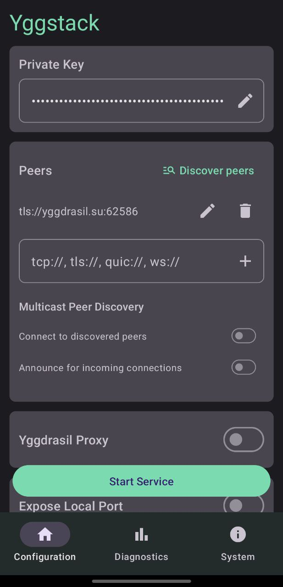
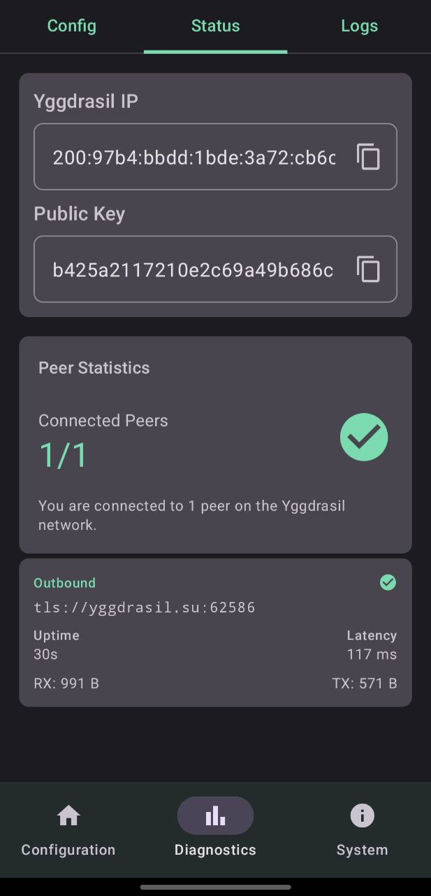
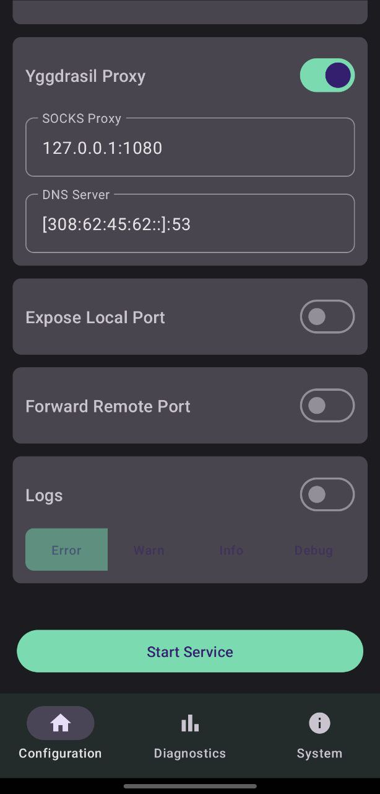
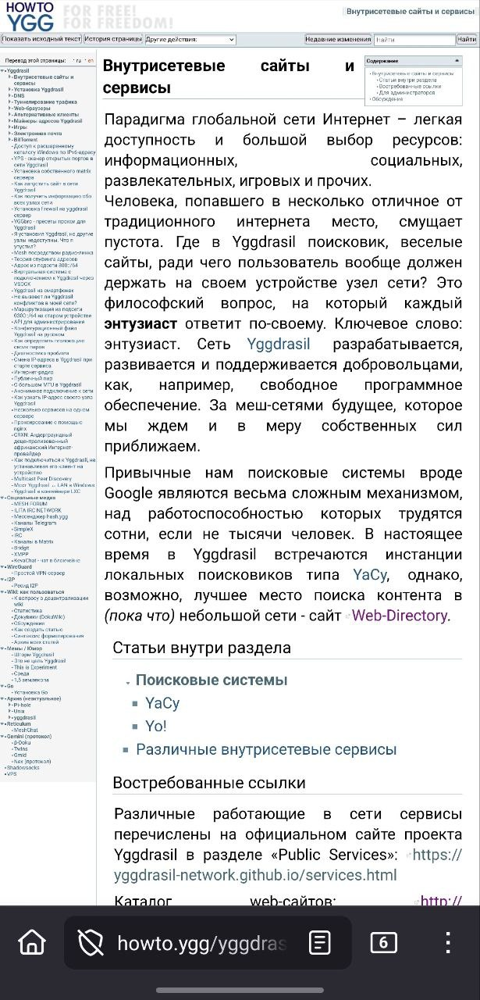
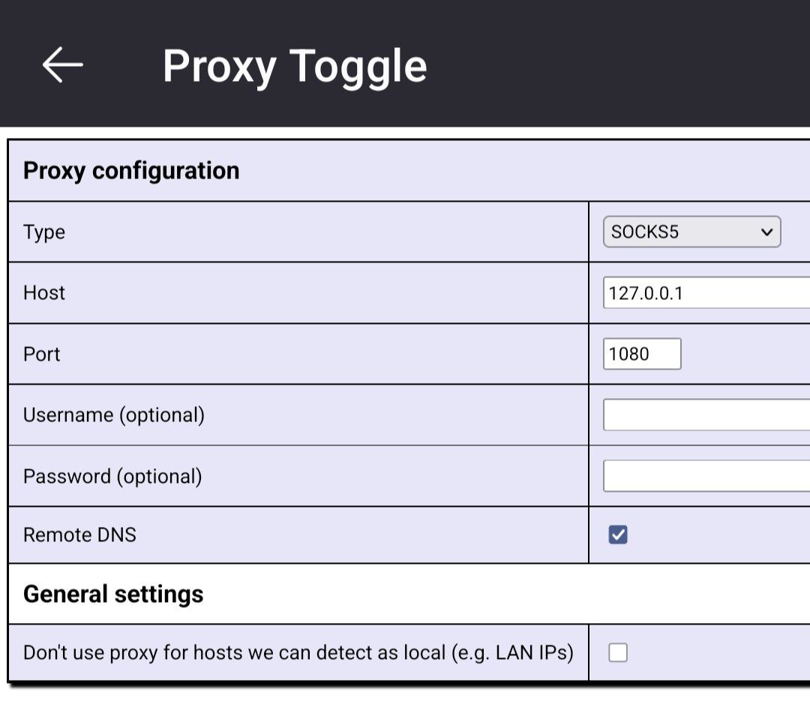
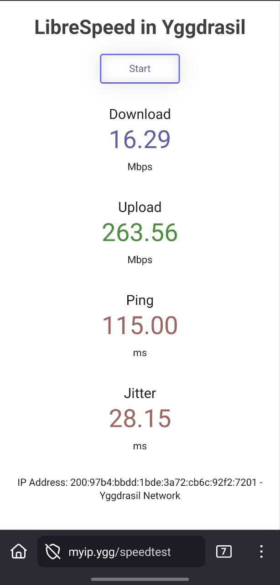
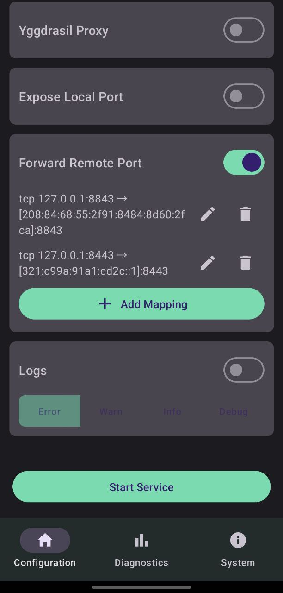
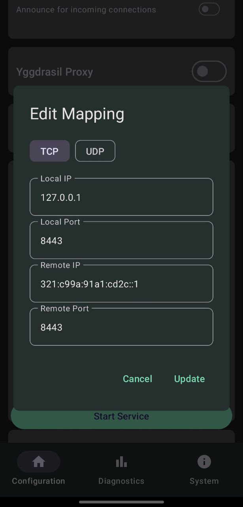
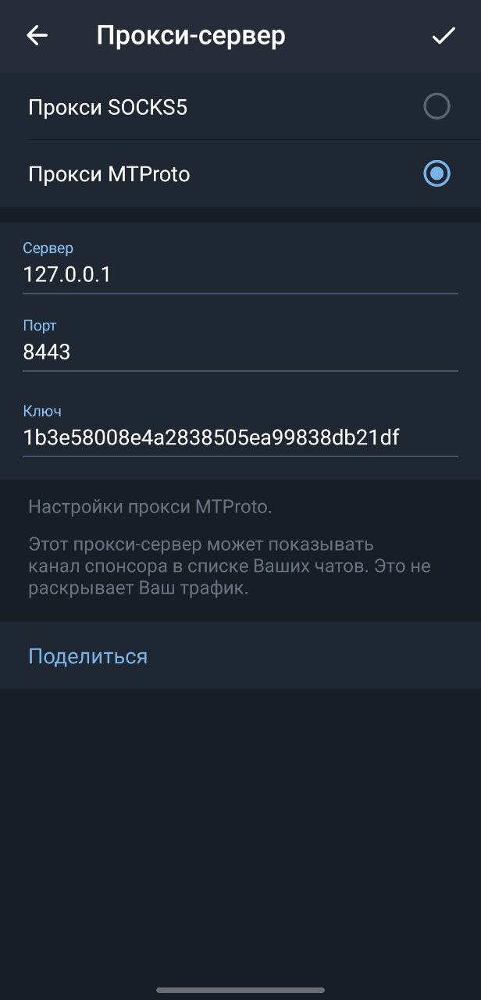
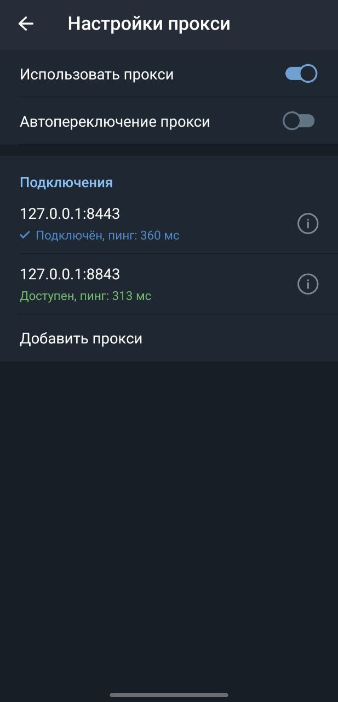

# Yggstack Android - SOCKS прокси / проброс сетевых портов поверх Yggdrasil сети
[🇬🇧 English](README.md) | [🇷🇺 Русский](#)

## Описание

Это полнофункциональная Android UI обертка для консольного приложения [Yggstack](https://github.com/yggdrasil-network/yggstack).

Yggstack предоставляет SOCKS5 прокси-сервер и проброс TCP портов через сеть Yggdrasil, аналогично TOR маршрутизатору. Также может служить самостоятельным узлом Yggdrasil для связывания сегментов сети.

* Не требуется VPN / TUN адаптер
* Не требуется root / доступ администратора
* Доступ через веб-браузер
* Проброс портов TCP/UDP

Больше информации о консольном приложении в [README.md](https://github.com/yggdrasil-network/yggstack) в репозитории yggstack.

## Скриншоты

  
  

## Варианты использования

### **SOCKS5 прокси** для доступа к веб-сайтам Yggdrasil. Работает на базе [Alfis](https://alfis.name) ([DNS](https://dns.r3v.dev/)).  
   Пример: Firefox + расширение Proxy Toggle.
   

     
     
     
     
   

### **Проброс mtproto порта Telegram** для стандартного Android клиента.
   

     
     
     
     
   

## Сообщества

Существует несколько IRC сообществ, включая канал #yggdrasil на libera.chat.  
Русскоязычное сообщество в Telegram: https://t.me/Yggdrasil_ru

## Лицензия

Этот код распространяется под условиями лицензии LGPLv3, но с дополнительным исключением,
которое было беззастенчиво взято из [godeb](https://github.com/niemeyer/godeb).
При определенных обстоятельствах это исключение разрешает распространение бинарных файлов,
которые (статически или динамически) связаны с этим кодом, без требования распространения
Минимального Соответствующего Исходного Кода или Минимального Кода Приложения.
Подробнее см.: [LICENSE](LICENSE).
